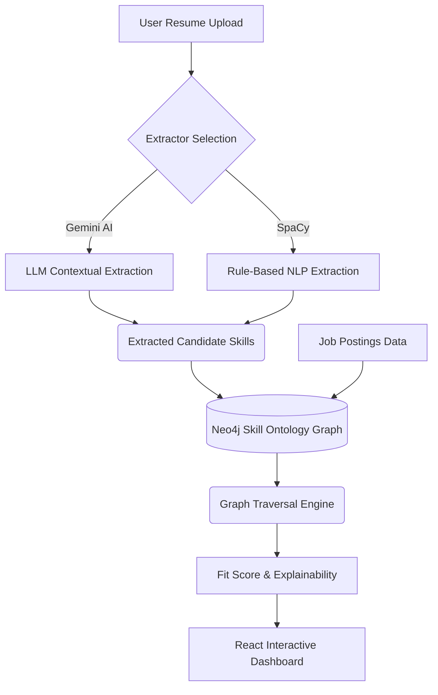

# Autonomous Skill Gap Analyzer & Job Targeting System

## Overview
  
This project is an intelligent, product-oriented system designed to empower job seekers by providing data-driven insights into their career progression. The system helps users:

  - Extract structured skills from their resume using dual-engine NLP (AI + Rule-based)
  - Identify jobs where they are strong candidates
  - Analyze skill gaps based on real job requirements
  - Explore interactive visual graphs showing how their skills semantically connect to jobs
  - Generate an optimized learning roadmap

Unlike traditional resume matchers, this system utilizes a **Neo4j Skill Ontology Graph** to model **skill dependencies, transferability, and semantic relationships**, enabling deep reasoning instead of simple keyword matching.

## Problem Statement
  
Job seekers face major hurdles in an increasingly competitive market:

1.  **Inconsistent Job Descriptions:** Job descriptions are noisy, inconsistent, and difficult to parse.
2.  **Shallow Matching:** Existing resume matchers rely on basic keyword comparison, missing context. For example, knowing "React" implies knowledge of "JavaScript", but traditional matchers fail to realize this.
3.  **Inefficient Learning:** Learning recommendations are typically unordered and fail to prioritize high-ROI skills.

## Solution
  
This project directly addresses these issues by:

  - Structuring skills into a hierarchical graph database (Neo4j Skill Ontology).
  - Offering a dual-extraction engine: Gemini LLM for deep contextual extraction, and SpaCy for precise rule-based extraction.
  - Normalizing and weighting job requirements automatically.
  - Ranking jobs by realistic fit probability using graph traversal (e.g., `SUBSET_OF`, `RELATED_TO` relationships).
  - Providing an interactive React-based frontend to visualize recommendations.

## Core Features

### 1. Dual-Engine Resume Parsing & Skill Extraction

| Capability               | Description                                        |
| :----------------------: | :------------------------------------------------: |
| **Input Support**        | Handles PDF and plain text resumes seamlessly.     |
| **AI Extraction**        | Uses Gemini LLM for deep contextual inference.     |
| **Rule Extraction**      | Uses spaCy for lightning-fast, precise PhraseMatching. |
| **Normalization**        | Maps raw text directly to canonical ontology IDs.  |

### 2. Skill Ontology & Neo4j Dependency Graph

A powerful knowledge base stored in **Neo4j** that defines how technical skills relate.

| Edge Type               | Purpose                                                    |
| :---------------------: | :--------------------------------------------------------: |
| **SUBSET_OF**           | Parent-child relationships (e.g., *FastAPI* is a subset of *Python*). |
| **RELATED_TO**          | Semantic similarity edges with confidence weights.         |

This graph structure allows the matching engine to grant candidates partial credit or infer prerequisite knowledge, discovering job fits that keyword matchers entirely miss.

### 3. Interactive Traversal Dashboard

A React frontend built with `react-force-graph-2d` that provides users with a visual, interactive mapping of exactly *why* a job was recommended, displaying the nodes and edges connecting their resume to the job description.

### 4. Job Fit Ranking Engine

Computes an objective, numerical fit score between the user's profile and target jobs.

**Output Categories:**

| Category            | Description                                    |
| :-----------------: | :--------------------------------------------: |
| **Strong Match**    | High alignment; immediate candidate.           |
| **Reachable**       | Close fit; typically 1–2 critical skills away. |
| **Low Probability** | Significant skill gap; long-term target.       |

The system provides an explainable reasoning block for every score.

### 5. Autonomous Ontology Expansion

The `ontology_expander.py` pipeline runs in the background or via manual trigger to continuously ingest new job postings and resumes, discover unseen skills, use AI to classify their parent categories, and autonomously patch the Neo4j graph with new nodes and edges.

## System Architecture



## Project Structure

```text
skillgap-analyzer/
│
├── app/
│   ├── main.py                # FastAPI entry point & core API logic
│   └── spacy_extractor.py     # Rule-based spaCy NLP engine
│
├── frontend/                  # Modern React UI (Vite + TypeScript)
│   ├── src/
│   │   ├── App.tsx            # Main shell routing
│   │   ├── LiveDemo.tsx       # Interactive job matching & graph viz
│   │   └── Research.tsx       # Data visualization for system metrics
│
├── research/                  # Data science, NLP, and model evaluation scripts
│   ├── models.py              # Neo4j and Keyword matching engines
│   ├── ontology_expander.py   # AI-powered graph self-expansion tool
│   ├── seed_graph.py          # Script to populate initial Neo4j state
│   └── *.json                 # Ground-truth datasets and resumes
│
├── data/                      # Application telemetry and usage logs
├── docker-compose.yml         # Container configuration for Neo4j Database
└── requirements.txt           # Backend dependencies
```

## Technology Stack

### Backend & Core
  - **Language:** Python 3.10+
  - **API Framework:** FastAPI
  - **Database:** Neo4j (Graph Database)

### Frontend
  - **Framework:** React + TypeScript (Vite)
  - **Visualization:** react-force-graph-2d
  - **Styling:** Custom CSS

### NLP & AI Processing
  - **LLM Engine:** Google Gemini (`gemini-flash-latest`)
  - **Core NLP Pipeline:** spaCy (`en_core_web_sm`)
  - **PDF Extraction:** PyPDF2

## Installation & Execution

### 1. Prerequisites
Ensure you have Python 3.10+, Node.js, and Docker (for Neo4j) installed.

### 2. Start Neo4j Database
```bash
docker-compose up -d
```
*(Optionally, seed the graph if starting fresh: `python research/seed_graph.py`)*

### 3. Backend Setup
```bash
# Set up Python environment and install dependencies
python -m venv .venv
# Activate environment (Windows: .venv\Scripts\activate, Mac/Linux: source .venv/bin/activate)
pip install -r requirements.txt
python -m spacy download en_core_web_sm

# Configure environment variables
# Create a .env file and add: GEMINI_API_KEY=your_key, NEO4J_URI=bolt://localhost:7687, NEO4J_USER=neo4j, NEO4J_PASSWORD=password

# Run Backend
python app/main.py
```

### 4. Frontend Setup
```bash
cd frontend
npm install
npm run dev
```

The Live Demo will be accessible at `http://localhost:5173`.
